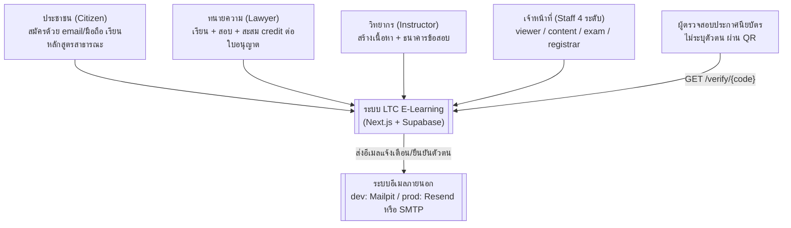
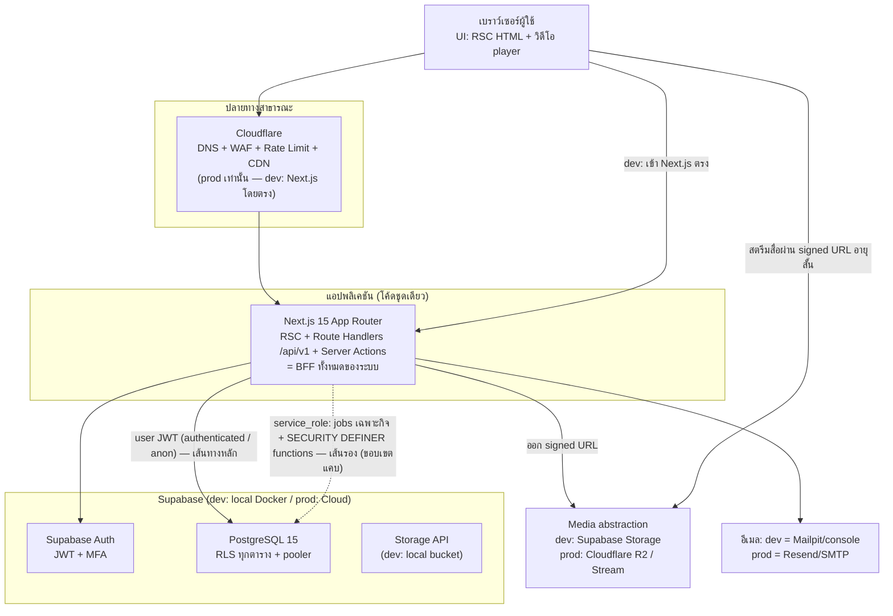
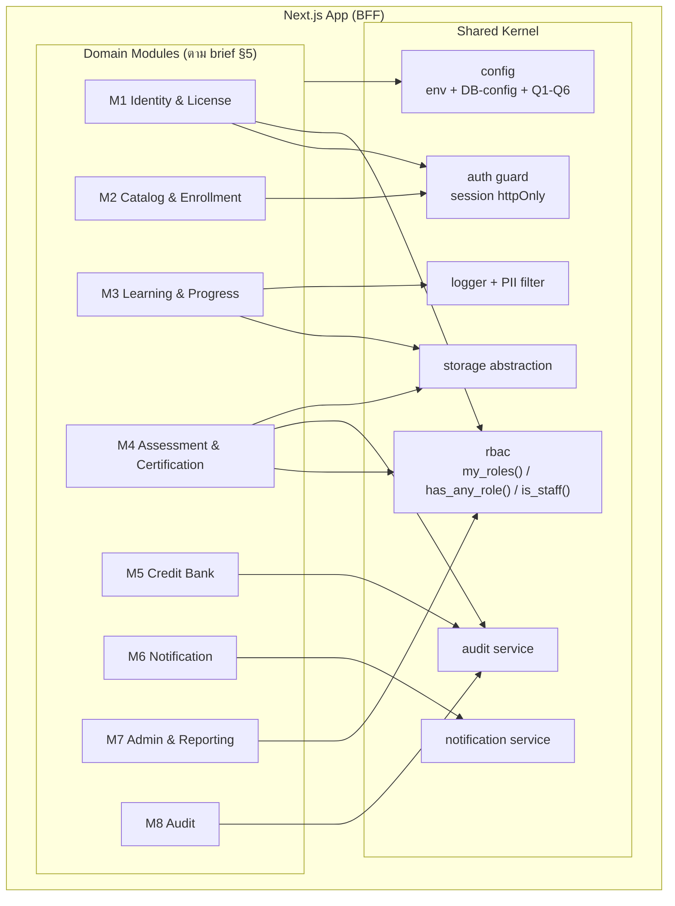
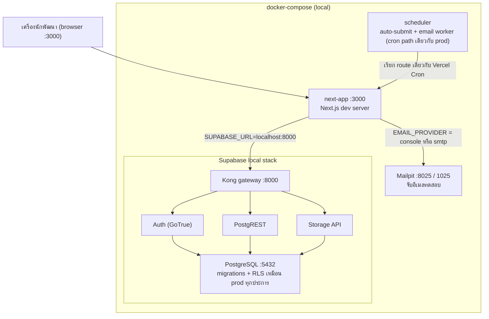
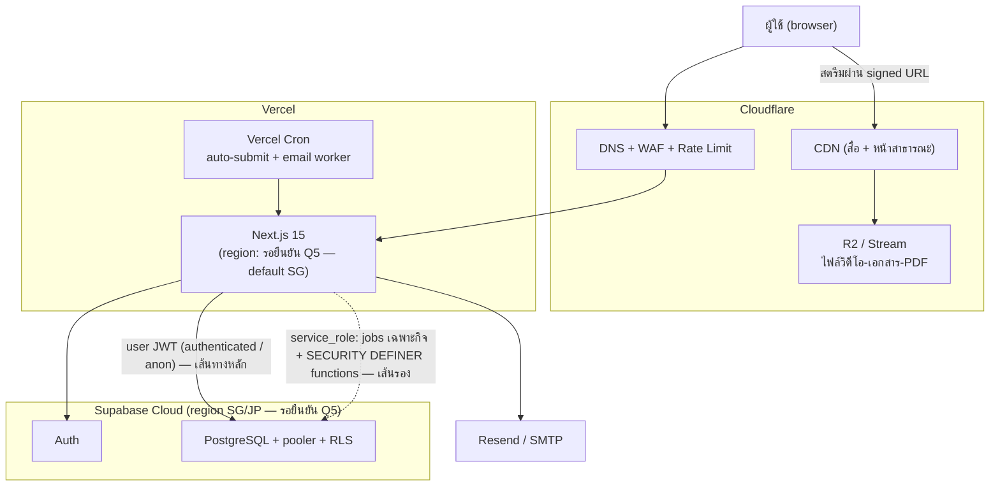
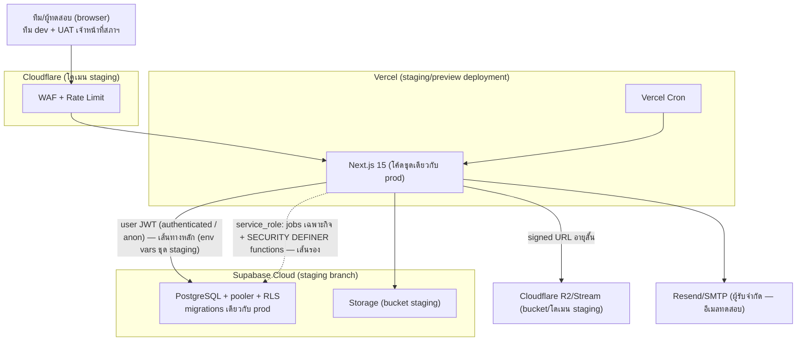
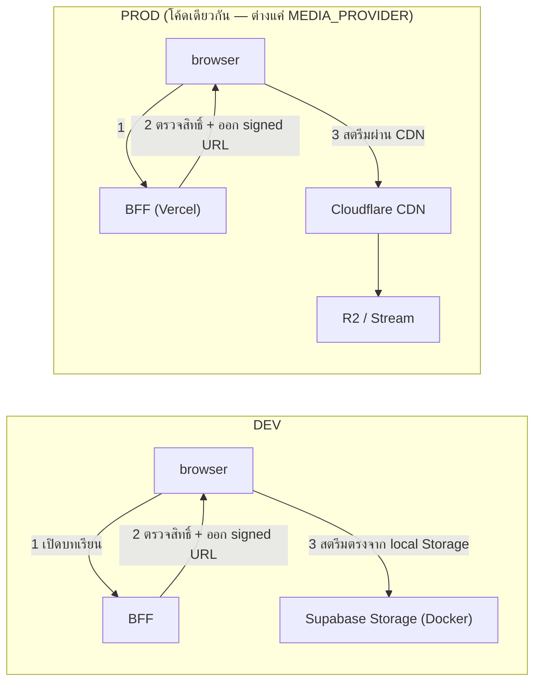
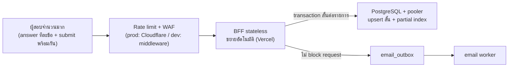
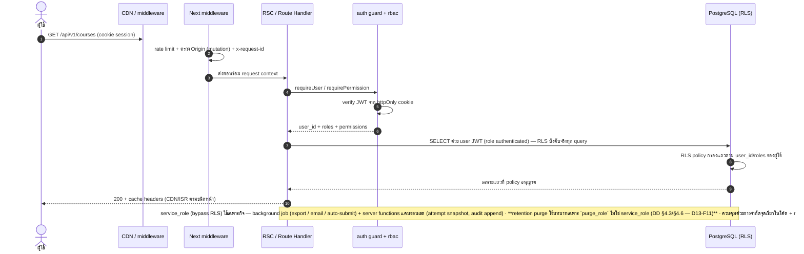
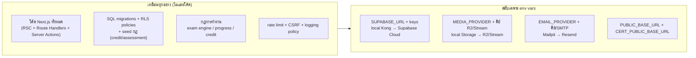

# ARCHITECTURE — แบบจำลองสถาปัตยกรรม (C4 + Deployment + Data Flow)

|          |                                                   |
| -------- | ------------------------------------------------- |
| เวอร์ชัน | 1.0.0 — ผ่าน CTO gate (codex รอบ 5: PASS — D17) · แก้ตาม D8–D16 · baseline สำหรับ Wave B |
| วันที่    | 2026-09-09                                        |
| เจ้าของ  | worker-3 (Wave A — deliverable 6)                 |
| สถานะ    | ผ่าน CTO gate (codex รอบ 5: PASS — D17)           |
| อ้างอิงบังคับ | PROJECT-BRIEF.md §6 (stack ตัดสินแล้ว), §8     |
| เอกสารเชื่อมโยง | SDS.md (การออกแบบเชิงลึก), DATA-DICTIONARY.md |

> หลักการกลาง (บังคับ): **โค้ดชุดเดียว รันได้ทั้ง local Docker (dev) และ cloud (prod) ต่างกันเฉพาะ env vars** — ทุกแผนภาพด้านล่างต้องอ่านได้ทั้งสอง environment โดยสลับเพียงปลายทางของการเชื่อมต่อ

## 1. System Context (C4-L1)

ภาพระดับบนสุด: ผู้ใช้ 4 personas ตาม brief §3 บวก "ผู้ตรวจสอบประกาศนียบัตร" ที่ไม่ต้อง login ระบบมีระบบภายนอกเดียวคืออีเมล (นำเข้า payment/live class ทีหลังตามขอบเขต v1)

## 2. Container (C4-L2)

บริการที่ "เป็นแอป" มีตัวเดียวคือ Next.js (ทำหน้าที่ BFF) — browser ไม่คุยกับ Postgres โดยตรง สื่อและอีเมลอยู่หลัง abstraction ที่สลับด้วย `MEDIA_PROVIDER`/`EMAIL_PROVIDER` ตามหลัก single codebase

## 3. Component (C4-L3) — ภายใน Next.js App

module ทั้ง 8 ไม่เรียกกันเองโดยตรง แต่แลกเปลี่ยนผ่าน event ภายใน (เช่น `assessment_attempt.passed` จาก M4 ไป M5 เพื่อ credit accrual — F15/D12; `certificate.issued` เป็นเหตุการณ์แจ้งเตือนเท่านั้น) และใช้ shared kernel ร่วมกัน — รายละเอียดความรับผิดชอบ/interface/dependency ของแต่ละ module อยู่ใน SDS.md §2

## 4. Deployment — DEV (100% local Docker)

dev รัน Supabase ชุดเต็มใน Docker ผ่าน Kong gateway — URL/คีย์ทั้งหมดชี้ localhost ผ่าน env vars โดยไม่แก้โค้ด scheduler ใน dev เป็น container ที่เรียก endpoint เดียวกับที่ prod ใช้ Vercel Cron เพื่อ parity ของพฤติกรรมเวลา

## 5. Deployment — PROD (100% cloud services)

prod วางเหมือน dev ทุกโครง ต่างเฉพาะปลายทาง: แอปบน Vercel, ข้อมูลบน Supabase Cloud, สื่อ/CDN/WAF บน Cloudflare — region ของ Vercel และ Supabase เลือกให้ใกล้กันและใกล้ไทย (Q5 PDPA cross-border, รอยืนยัน)

### 5.5 Deployment — STAGING (cloud preview ก่อนขึ้น prod — brief §6, DCR-1)

- **วัตถุประสงค์ (brief §6 เพิ่มเมื่อ 0.2.0 ตาม DCR-1)**: environment ระดับกลางที่แยกจาก dev และ prod ไว้พิสูจน์ว่าระบบรับโหลดและปลอดภัยจริง **ก่อน promote ขึ้น prod**
- **โครงเหมือน prod ทุกประการ โค้ดชุดเดียวกัน**: ใช้ config/โค้ดชุดเดียวกับ prod ต่างกันเฉพาะ **environment variables** (ปลายทาง Supabase staging branch, โดเมน/คีย์ staging ของ Cloudflare, คีย์อีเมล staging) — ห้าม branch โค้ดหรือ business logic ตาม environment ตามหลักการกลางด้านบน
- **Gate ก่อน promote ขึ้น prod**: performance test ด้วย k6 (เป้าหมาย brief §7: **10,000 concurrent learners / 5,000 exam takers**) + security test (รวมการตรวจ RLS/rate limit ตาม brief §8) ผ่านครบก่อน แล้วจึง promote — เกณฑ์ละเอียดอยู่ที่ TEST-PLAN §4 (Wave D)
- **ขอบเขตข้อมูล**: เฉพาะข้อมูลทดสอบ/ข้อมูลจำลอง — ห้ามใส่ PII จริง (PDPA, brief §8); งบ cloud tier ของ staging ผูกกับ Q7 (PROJECT-PLAN QP-5/Q7)

หมายเหตุ: staging ไม่ใช่ environment ที่สามของ "โค้ดคนละชุด" — เป็น deployment ชุดเดียวกันกับ prod บนปลายทาง cloud อีกชุด เพื่อให้ผล k6/security test ที่พิสูจน์บน staging อ้างอิงไป prod ได้จริง

## 6. Data Flow — สื่อ และ ช่วงคาบสอบ

### 6.1 วิดีโอ streaming (dev ตรง vs prod ผ่าน CDN)

เส้นทางสตรีมไม่ผ่าน app server ทั้งสอง environment — BFF ทำแค่ "ตรวจสิทธิ์แล้วออก signed URL อายุสั้น" ผลต่างเดียวคือปลายทาง storage ที่ abstraction เลือกให้ตาม env var

### 6.2 Exam submission burst (สอบพร้อมกัน ~5,000 คน)

answer save เป็น upsert transaction สั้น + rate limit ต่อ attempt เพื่อกระจายโหลด; งานส่งอีเมลปลอด path นี้ไป outbox แล้ว worker ดึงทีหลัง — รายละเอียดใน SDS §3.1 และ §8

## 7. Sequence — request ธรรมดาพร้อม RLS check

เส้นทางหลักของ request ธรรมดา = **user JWT (role `authenticated`)** — RLS policy บังคับจริงทุก query; `service_role` (bypass RLS) ใช้เฉพาะงานเบื้องหลังและ server functions ที่ขอบเขตแคบ เช่น attempt snapshot / audit append — ความปลอดภัยของเส้นทาง service_role พึ่งการจำกัดจุดเรียกในโค้ด + code review **ไม่ใช่ RLS** (RLS ไม่คุม service_role — D11-1) · ทุกตารางยังต้อง ENABLE RLS + policy ครบทุก path สำหรับ anon/authenticated ตาม DATA-DICTIONARY.md และ authorization ตัดสินที่ rbac service (`requirePermission()` — RBAC §1.2 ข้อ 4) ก่อน query เสมอ

## 8. Migration Path dev → staging → prod (อะไรเปลี่ยน / อะไรเหมือน)

| ด้าน | DEV (local Docker) | STAGING (cloud preview) | PROD (cloud) | สิ่งที่สลับด้วย env vars |
| ---- | ------------------ | ---------------------- | ------------ | ---------------------- |
| แอป | next-app container :3000 | Vercel staging/preview deployment | Vercel | `PUBLIC_BASE_URL`, คีย์ platform |
| DB/Auth/Storage | Supabase local (Kong :8000, PG :5432) | Supabase Cloud **staging branch** | Supabase Cloud (region SG/JP) | `SUPABASE_URL`, `SUPABASE_ANON_KEY`, `SUPABASE_SERVICE_ROLE_KEY`, `SUPABASE_DB_POOLER_URL` — migrations เดียวกันทุก env |
| สื่อ | Supabase Storage (Docker volume) | Cloudflare R2/Stream + CDN (bucket/โดเมน staging) | Cloudflare R2/Stream + CDN | `MEDIA_PROVIDER=r2\|stream` + คีย์ |
| อีเมล | Mailpit (จับทดสอบ) | Resend/SMTP staging (ผู้รับจำกัด) | Resend/SMTP จริง | `EMAIL_PROVIDER` + คีย์ |
| WAF/Rate limit | Next middleware (in-memory) | Cloudflare + middleware ชั้นใน | Cloudflare + middleware ชั้นใน | ค่า config ชุดเดียวกัน |
| Cron | container scheduler | Vercel Cron | Vercel Cron | endpoint เดียวกันทุก env |
| การใช้งาน | วนลูปพัฒนา | พิสูจน์ k6 10k/5k + security test + UAT ก่อน promote | ผู้ใช้จริง | โค้ด/migrations/config ชุดเดียวกัน |

สรุป: การ "ขึ้น staging หรือ prod" = รัน migrations เดียวกัน + ตั้ง env vars ชุดของ environment นั้น — ไม่มีการแก้โค้ดหรือ branch ตาม environment (บังคับโดย review + lint) และ promote ขึ้น prod ต้องผ่าน gate บน staging ก่อน (k6 + security — §5.5)
