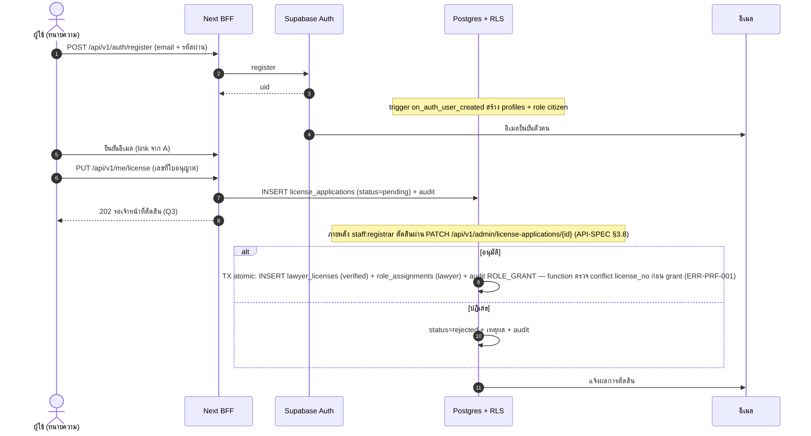
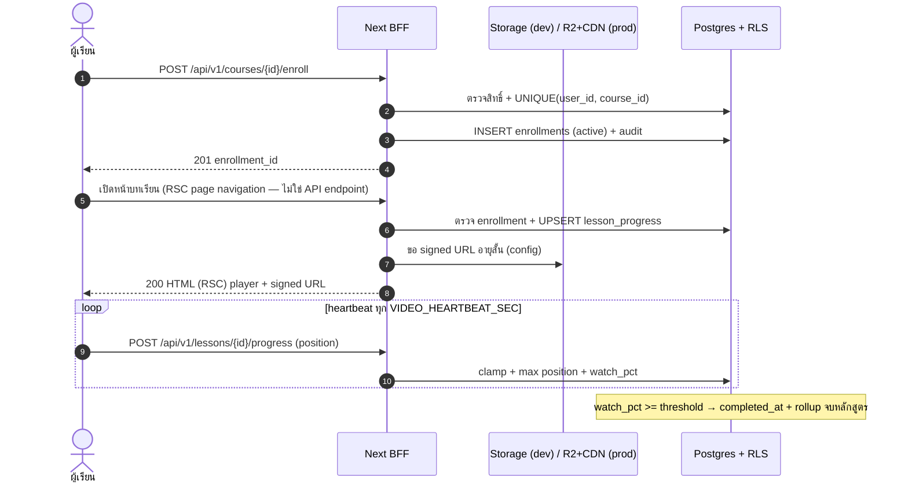
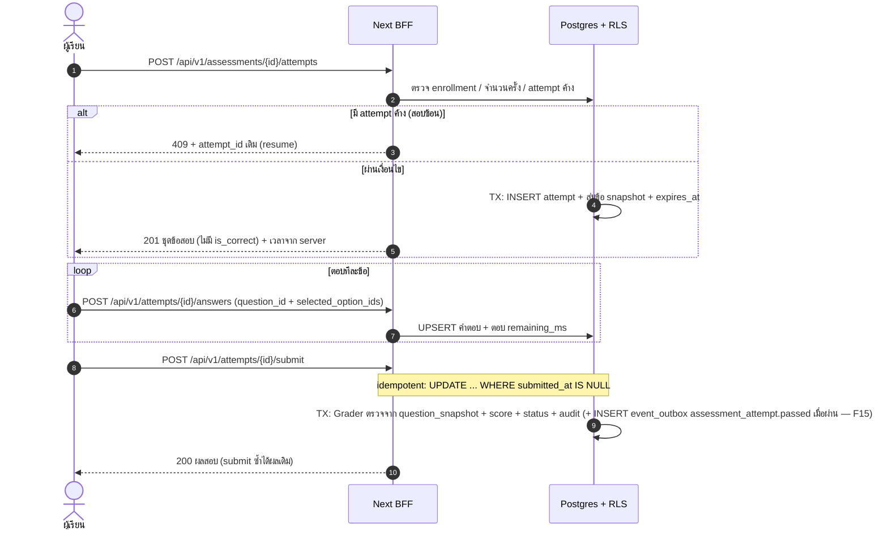
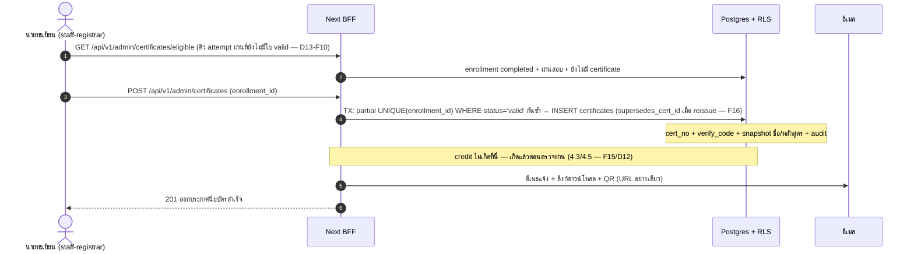
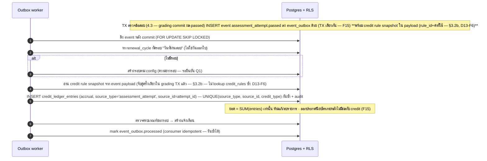
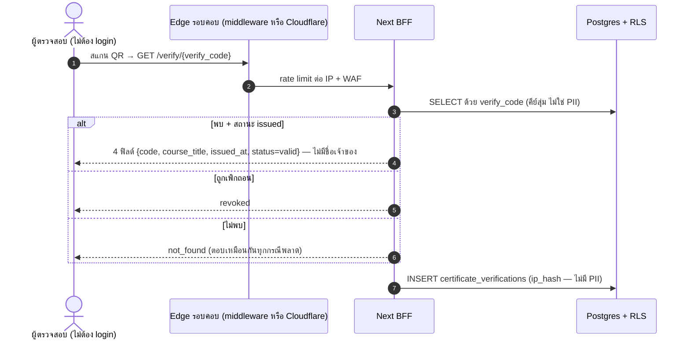

# SDS — Software Design Specification (การออกแบบระบบเชิงลึก)

|          |                                                   |
| -------- | ------------------------------------------------- |
| เวอร์ชัน | 1.0.0 — ผ่าน CTO gate (codex รอบ 5: PASS — D17) · แก้ตาม D8–D16 · baseline สำหรับ Wave B |
| วันที่    | 2026-09-09                                        |
| เจ้าของ  | worker-3 (Wave A — deliverable 5)                 |
| สถานะ    | ผ่าน CTO gate (codex รอบ 5: PASS — D17)           |
| อ้างอิงบังคับ | PROJECT-BRIEF.md §5–§10, GLOSSARY.md          |
| เอกสารเชื่อมโยง | ARCHITECTURE.md, DATA-DICTIONARY.md, SRS.md, API-SPECIFICATION.md, RBAC-DESIGN.md, AUDIT-LOG-DESIGN.md |

> โครงสร้างข้อมูล (ตาราง/คอลัมน์) ระบุไว้ที่ DATA-DICTIONARY.md ฉบับเดียว — SDS อ้างอิงชื่อตารางโดยไม่ซ้ำซ้อนรายละเอียด
> ถ้าโค้ดพบปัญหาในเอกสารนี้ ยื่น DCR (brief §9.1) ก่อนแก้เสมอ

## 1. ภาพรวมและวัตถุประสงค์

### 1.1 วัตถุประสงค์

แปลงความต้องการจาก SRS ให้เป็นการออกแบบที่นำไปเขียนโค้ดได้ทันทีใน Wave B–E ครอบคลุม: การแบ่งระบบเป็น module, การออกแบบเชิงลึกของกลไกที่มีความเสี่ยงสูง (exam engine, credit bank, progress tracking, certificate), การไหลของงานหลัก (sequence), แนวทางความปลอดภัย, การจัดการ error/log และ config และแนวทางขยายระบบ

### 1.2 ขอบเขต

- ครอบคลุม v1 ตาม brief §2: หลักสูตร self-paced, สอบปลายหลักสูตร, ประกาศนียบัตร + verify, credit bank, สมาชิก/บัญชี, admin back-office, รายงาน, audit log, แจ้งเตือนพื้นฐาน
- ไม่ครอบคลุม (นอกขอบเขต v1): ชำระเงิน, live class, SCORM เต็มรูปแบบ, mobile native, AI assistant

### 1.3 หลักการออกแบบ (binding — ต้องเป็นจริงในโค้ดทุกจุด)

1. **Single codebase / dev-prod parity**: โค้ดชุดเดียวรันได้ทั้ง local Docker และ prod cloud ต่างกันแค่ env vars (brief §6) — ห้าม branch business logic ตาม environment โดยตรง ให้เข้าผ่าน config layer เท่านั้น
2. **Config-driven**: ค่ากฎทั้งหมด (เกณฑ์ผ่าน, จำนวนครั้ง, credit, รอบต่ออายุ, proctoring) เป็น config พร้อมค่าเริ่มต้น (ยึด **SRS Appendix A เป็น defaults master เดียว** — D8; เอกสารอื่นอ้างอิง ห้ามประกาศค่าซ้ำ) + ธง "รอยืนยัน Q#" (CTO decision D3) — ห้าม hardcode
3. **RLS เปิดทุกตาราง** + บทบาท DB แบบ least-privilege (brief §8)
4. **Audit ทุก action สำคัญ** append-only บังคับด้วย DB privileges + RLS (decision D6)
5. TypeScript strict + ตรวจ input ด้วย zod ทุกขอบเขต (API, Server Action, DB write path)
6. ห้าม log PII — อ้างอิงด้วย `user_id` เสมอ (brief §8)

## 2. การแบ่งระบบเป็น Module (ตาม 8 โดเมน brief §5)

ระบบเป็น Next.js application ชุดเดียว (deploy แบบเดียวกันทั้ง dev/prod) แบ่งเป็น module เชิงตรรกะตาม bounded context — module คือขอบเขตของโค้ด + ขอบเขตการเป็นเจ้าของตาราง ไม่ใช่ process แยก

| ID | Module | ความรับผิดชอบหลัก | Interface ที่เปิด (path ยึด API-SPECIFICATION.md) | การพึ่งพา |
| -- | ------ | ---------------- | ----------------- | --------- |
| M1 | Identity & License | สมัคร/ยืนยันตัวตน, profile, คำขอผูกเลขที่ใบอนุญาต + การตัดสินโดยเจ้าหน้าที่, PDPA consent | `/auth/*`, `/me`, `PUT /me/license`, `/profile/*` (export/delete/consents), admin: `/admin/license-applications/*`, `/admin/users/*` | Supabase Auth, shared (auth guard, rbac, audit) |
| M2 | Catalog & Enrollment | หมวด/หลักสูตร/โมดูล/บทเรียน, ค้นหา, ลงทะเบียน, เงื่อนไขเข้าเรียน | `/categories`, `/courses`, `/courses/{id}`, `POST /courses/{id}/enroll`, `/me/enrollments` | M1 (สิทธิ์), M3 (เงื่อนไข prerequisite) |
| M3 | Learning & Progress | ให้บริการเนื้อหาบทเรียน (วิดีโอ/เอกสาร/quiz), heartbeat, คำนวณความคืบหน้า, เกณฑ์จบบท/จบหลักสูตร | `/courses/{id}/progress`, `POST /lessons/{id}/progress`, `POST /lessons/{id}/quiz/submit` | M2, storage abstraction, media_assets |
| M4 | Assessment & Certification | ธนาคารข้อสอบ, กติกาสอบ, exam engine (สุ่ม/จับเวลา/submit/ตรวจ), ออกประกาศนียบัตร + public verify | `/assessments/{id}`, `POST /assessments/{id}/attempts`, `/attempts/{id}/answers`, `/attempts/{id}/submit`, `/attempts/{id}/result`, `/me/attempts`, `/me/certificates`, `/certificates/{code}` (สาธารณะ), admin: `/admin/certificates/*` | M2, M3, M5 (hook หลังผ่าน), storage abstraction (PDF) |
| M5 | Credit Bank | กฎ credit, ledger append-only, รอบต่ออายุ, ยอดรวม | `/me/credits`, `/me/transcript`, admin: `/credit-rules/*`, `/credit-adjustments`, `/users/{id}/credits`; รับ event `assessment_attempt.passed` (credit เกิดตอนตรวจผ่าน — F15/D12; `certificate.issued` เป็นเหตุการณ์แจ้งเตือนเท่านั้น) | M4 (attempt/certificate), M1 (license) |
| M6 | Notification | แจ้งเตือนในระบบ + อีเมล (เทมเพลตไทย), outbox + worker, ตั้งค่ารายบุคคล | `/me/notifications`, `/me/notifications/{id}/read`, `/me/notification-settings`; service `notify(userIds, topic, payload)` ให้ module อื่นเรียก | email provider abstraction (dev: console/Mailpit, prod: Resend/SMTP) |
| M7 | Admin & Reporting | dashboard, รายงานเรียน/สอบ/credit, export CSV/JSON (job), ค้นหาผู้ใช้ | `/admin/dashboard`, `/admin/reports/*`, `/admin/reports/{type}/export`, `/admin/users/*`, `/admin/courses/*`, `/admin/exams/*` | ทุก module (อ่านผ่าน view/JOIN), M8 |
| M8 | Audit | บันทึก action สำคัญ append-only + security events, ค้นหา audit สำหรับ admin | service `audit(actor, action, entity, before, after)`; อ่าน: `/admin/audit-logs` — ไม่มี API เขียน/แก้/ลบ | shared (rbac) — ไม่พึ่งพา module อื่น (กัน loop) |

### 2.1 Shared Kernel (ใช้ร่วมทุก module)

| ส่วน | หน้าที่ |
| ---- | ------ |
| `auth guard` | อ่าน/verify session จาก Supabase Auth cookie (httpOnly), ให้ `requireUser()` / `requirePermission()` (RBAC §1.2 ข้อ 4 — ห้าม requireRole) |
| `rbac` | ตรวจสิทธิ์ตาม role_assignments (helper ชุด canonical เดียวกับ RLS policy ใน DB: `my_roles()` / `has_any_role(text[])` / `is_staff()` — นิยามที่ RBAC-DESIGN.md §3.1) |
| `audit service` | เขียน audit_logs จาก server เท่านั้น, ไม่มี path แก้/ลบ |
| `notification service` | สร้าง notifications + จัดคิวอีเมลลง email_outbox (ไม่ block request) |
| `storage abstraction` | interface เดียว: dev = Supabase Storage (Docker), prod = Cloudflare R2/Stream — สลับด้วย `MEDIA_PROVIDER` |
| `config` | อ่าน env + DB-config, มี default + ตรวจครบตอน boot, ธง "รอยืนยัน Q#" (ดู §7) |
| `logger` | structured JSON + PII filter แบบ allowlist (ดู §6) |
| `zod schemas` | schema กลางของ input ทุกจุด ใช้ร่วม API + Server Action |

## 3. การออกแบบเชิงลึก

> **การเขียนของผู้เรียน = ผ่าน server functions เท่านั้น (F2/D12)** — `enroll()` / `record_lesson_progress()` / `record_quiz_attempt()` / `start_attempt()` / `save_answer()` / `submit_attempt()` (SECURITY DEFINER — owner เฉพาะ, ตรวจสิทธิ์/เงื่อนไขธุรกิจ + audit ข้างใน) — รายละเอียดครบที่ DATA-DICTIONARY §4.7; ข้อความใน §3 ที่อธิบายการเขียนลงตาราง ให้อ่านว่าเกิดภายใน functions เหล่านี้ (ผู้เรียนไม่มี INSERT/UPDATE policy บนตารางเหล่านั้น)

### 3.1 Exam Engine (M4)

องค์ประกอบ: `AssessmentOrchestrator` (เริ่ม/submit), `QuestionSampler` (สุ่มข้อ), `Grader` (ตรวจ), ใช้ `assessment_rules` เป็น config ต่อการสอบ (Q2)

**a) เริ่มสอบ (`POST /api/v1/assessments/{id}/attempts`)** — เงื่อนไขก่อนสร้าง attempt (ตรวจใน transaction เดียว):
- enrollment ของหลักสูตรนี้อยู่สถานะ `active`
- ถ้า rules.require_course_complete = true → บทเรียนครบทุกโมดูลก่อน
- จำนวนครั้งที่ใช้ < rules.max_attempts (นับทุก attempt ที่ไม่ `voided`)
- ไม่มี attempt สถานะ `in_progress` ค้างอยู่ (ดู "ป้องกันสอบซ้อน")

**b) สุ่มข้อ (snapshot ไม่ใช่ reference แบบเปลี่ยนได้)** — ภายใน transaction ของการ start:
- คัด pool ตาม rules.selection (bank/category/difficulty) → `ORDER BY random() LIMIT rules.question_count`
- สร้างแถว `attempt_answers` ทันทีทีละข้อ (answer = null) + `seq` ลำดับที่สุ่มได้ + `option_order` (ถ้า rules.shuffle_options) — ข้อสอบ "ตาตัว" ตลอด attempt แม้เจ้าหน้าที่แก้ธนาคารข้อสอบภายหลัง
- **snapshot เก็บข้อมูลตรวจครบ (D11-16)**: แต่ละแถว `attempt_answers.question_snapshot` (jsonb) เก็บโจทย์/ตัวเลือก/is_correct/points + เวอร์ชันของ question ณ วินาที start — Grader ตรวจจาก snapshot ล้วน ๆ ไม่อ่านตาราง questions อีก ทำให้การแก้ไข/retire ข้อสอบระหว่างสอบไม่กระทบ attempt ที่กำลังดำเนินอยู่ และตรวจซ้ำภายหลังได้ผลเดิมเสมอ
- ตั้ง `started_at = now()` (DB clock) และ `expires_at = started_at + rules.time_limit_minutes`

**c) จับเวลา server-side** — แหล่งจริงเดียวคือ `expires_at` ใน DB:
- client นับถอยหลังจากค่าที่ server ส่งมาเท่านั้น (ไม่เชื่อ client clock)
- ทุกคำตอบที่บันทึก จะได้ `remaining_ms` กลับจาก server
- คำตอบที่ส่งหลัง `expires_at` → ปฏิเสธ (422 `ERR-ASM-004`) และ attempt ถูกปิดโดย auto-submit
- auto-submit: scheduler (dev: คอนเทนเนอร์ cron / prod: Vercel Cron) เรียก path เดียวกันทุก 1 นาที ปิด attempt `in_progress` ที่เลยเวลา → ตรวจจากคำตอบที่บันทึกไว้

**d) บันทึกคำตอบทีละข้อ (`POST /attempts/{id}/answers`)**
- upsert บน UNIQUE(attempt_id, question_id) — idempotent ต่อข้อ (เขียนทับข้อเดิมได้ก่อน submit)
- ตรวจ: ข้อนี้อยู่ใน snapshot ของ attempt, attempt ยัง `in_progress`, ยังไม่ถึง `expires_at`
- rate limit ต่อ attempt (config) กัน spam; validation ด้วย zod (`selected_option_ids` ต้องเป็น subset ของ options ที่ถูกต้องตาม type)

**e) Submit แบบ idempotent (`POST /attempts/{id}/submit` — request ต้องมี header `Idempotency-Key` ตาม API-SPEC)**
- แกนคือ `UPDATE assessment_attempts SET submitted_at = now() WHERE id = $1 AND submitted_at IS NULL RETURNING ...`
- ได้ 0 แถว = submit ไปแล้ว → ตอบผลเดิม (200) ไม่ตรวจซ้ำ ไม่นับ attempt เพิ่ม — retry/ดับเบิลคลิก/เน็ตหลุดปลอดภัย
- ตอบกลับทันทีด้วย `status=grading`; ผลละเอียด + เฉลย (ตาม `exam_review_mode` — SRS Appendix A) อ่านที่ `GET /attempts/{id}/result` — แยกชัดระหว่าง "รับ submit แล้ว" กับ "ผลตรวจละเอียด" และรองรับการเปลี่ยนเป็นตรวจแบบ job ภายหลังได้ไม่กระทบ contract
- ตรวจคะแนน (Grader): เทียบ `selected_option_ids` กับ **`is_correct`/`points` ใน `attempt_answers.question_snapshot` ล้วน ๆ** (F14/D12 — ไม่อ่านตาราง questions/question_options ขณะตรวจ เพื่อกันข้อสอบถูกแก้ระหว่างสอบและให้ตรวจซ้ำได้ผลเดิมเสมอ; ฝั่ง server เท่านั้น — client ไม่เคยได้รู้ is_correct), คำนวณ `score_pct`, ตั้ง status `passed`/`failed` ตาม rules.pass_pct — ทั้งหมดภายใน `submit_attempt()` (F2)
- ถ้าผล `passed` → INSERT event `assessment_attempt.passed` ลง `event_outbox` **ใน TX ตรวจเดียวกัน** — credit เกิดตอนตรวจผ่าน ไม่ใช่ตอนออกประกาศนียบัตร (F15/D12 — ดู §3.2b)

**f) ป้องกันสอบซ้อน (concurrent attempts)**
- partial UNIQUE index: `(assessment_id, user_id) WHERE status = 'in_progress'` — DB บังคับแม้มี bug
- เปิดแท็บ/อุปกรณ์ที่สอง → ได้ 409 พร้อม `attempt_id` เดิมเพื่อ resume (เข้า resume ได้จนกว่าจบเวลา)
- **lease ผูก session (F22/D12)**: attempt ผูก `session_id` (จาก JWT claim) + `lease_expires_at` — session/อุปกรณ์อื่นยิง answers/submit **ถูกปฏิเสธ 409 ขณะ lease ยัง active** (บังคับใน `save_answer()`/`submit_attempt()` เทียบ session_id + lease_expires_at); takeover ได้เมื่อ lease หมดอายุ (lease ต่อทุกครั้งที่ save answer; หลังตัดการเชื่อมรอ `exam_disconnect_grace_minutes` default 5 นาที) พร้อม audit `EXAM_SESSION_TAKEOVER`
- attempt_no กำหนดจาก count ภายใน transaction + UNIQUE(assessment_id, user_id, attempt_no) กันแข่ง

**g) Proctoring (Q4 — รอยืนยัน)**: `proctoring_mode = none | basic` default `basic` ตาม SRS Appendix A (`proctoring_mode`); `basic` = สุ่มข้อ + จับเวลา server + block session ซ้อน (ไม่บันทึกหน้าจอ/กล้องตามเหตุผลความเป็นส่วนตัว) + เก็บเหตุการณ์ client (tab blur ฯลฯ) ลง `assessment_attempts.client_events` (jsonb จำกัดขนาด, ไม่มี PII)

### 3.2 Credit Bank (M5)

**a) โครงสร้าง**: `credit_rules` (กฎ แก้ได้) + `renewal_cycles` (รอบต่ออายุรายคน) + `credit_ledger_entries` (รายการเคลดิต **append-only**) — ยอด credit เป็น "ผลรวมที่คำนวณ" ไม่มีการเก็บยอดคงค้างแบบแก้ไขได้

**b) การเกิดรายการ (accrual) — เกิดตอนตรวจผ่าน (grading commit) ไม่ใช่ตอนออกประกาศนียบัตร (F15/D12) — ส่งผ่าน transactional outbox (D11-17)**:
- **จุดเกิด credit = grading commit ที่ผล `passed`** (§3.1e): TX ตรวจข้อสอบ INSERT event `assessment_attempt.passed` ลง `event_outbox` **ใน transaction เดียวกัน** — กัน event หาย/partial write; **การออกประกาศนียบัตรภายหลังเป็นธุรกรรมงานทะเบียน ไม่มีผลกับ credit อีกต่อไป**
- worker ดึง event หลัง commit (`FOR UPDATE SKIP LOCKED`) → หา `renewal_cycles` ที่**ครอบวันที่ผ่านสอบ** [starts_on, ends_on]; ถ้าไม่มี → สร้างรอบใหม่ตาม config (ความยาวรอบ + จุดเริ่ม = config Q1, รอยืนยัน)
- จับคู่ `credit_rules` **เกิดครั้งเดียว ณ grading (D13-F6)**: ใน TX ตรวจข้อสอบ (`submit_attempt()`) จับคู่ rule ที่ status='active' + effective window ครอบวันผ่าน แบบเจาะจงก่อน (course_id ตรง) แล้วค่อยกฎทั่วไปตาม `priority` แล้ว **snapshot ผลการจับคู่ (`rule_id` + credits + credit_type + renewal_cycle + valid_days) ลง payload ของ outbox event** — credit worker ใช้ snapshot จาก event อย่างเดียว **ไม่ lookup `credit_rules` ซ้ำ** (กันกรณี rule ถูก retire ระหว่าง event ค้างคิวทำให้ credit หาย — กฎ active ไม่แก้ย้อนหลังอยู่แล้วจึง snapshot ครั้งเดียวพอ)
- INSERT entry: {user_id, cycle_id, type=accrual, credit_type, amount, **source_type='assessment_attempt' (source_id = attempt_id)**, rule_id} — **idempotent กัน event ส่งซ้ำด้วย UNIQUE(source_type, source_id, credit_type)** (partial, WHERE entry_type='accrual' — DATA-DICTIONARY `credit_ledger_entries`); สำเร็จแล้ว worker mark event `processed`

**c) การแก้ไข = รายการชดเชย ไม่ใช่การแก้ย้อน**:
- ผิดพลาด → entry `reversal` (amount ติดลบ อ้าง original entry) โดย staff:registrar/super_admin เท่านั้น + เหตุผล + audit
- ปรับมือ → entry `adjustment` (signed) ด้วยเหตุผลบังคับ
- `credit_ledger_entries` ไม่มี path UPDATE/DELETE ทุกชั้น (API, RLS, DB grants — เช่นเดียวกับ audit_logs ตาม D6)

**d) ยอดและการปิดรอบ**:
- ยอดต่อรอบ = SUM(amount) แยกตาม credit_type ผ่าน view `v_credit_balance` (reporting ใช้ view เดียวกัน)
- ปิดรอบ: status `closed`, snapshot ยอด, รายการเก่าคงอยู่เพื่อประวัติ; กฎ carry-over/อายุ credit เป็น config (Q1, รอยืนยัน) — ถ้ากำหนดอายุ จะบันทึก entry `expiry` ตอนปิดรอบ
- `required_credits` snapshot ไว้ในรอบตอนสร้าง เพื่อไม่ให้การแก้กฎย้อนหลังกระทบรอบเก่า

### 3.3 Progress Tracking (M3)

**a) หลักการ**: client ส่ง "หลักฐาน" (ตำแหน่งวิดีโอ, เวลาพำนัก) — server เป็นผู้ตัดสินความสมบูรณ์เสมอ client ส่ง `completed=true` ตรง ๆ ไม่ได้

**b) วิดีโอ** (คลิปจำกัด ≤ 60 นาที / ความละเอียดสูงสุด 1080p ตาม SRS Appendix A `video_max_minutes`, `video_max_resolution` — ธง Q6):
- player ส่ง heartbeat `POST /lessons/{id}/progress` ทุก `VIDEO_HEARTBEAT_SEC` (default 15, config) พร้อม `position_sec`
- **server สะสม bounded playback intervals (D11-15)**: แต่ละ heartbeat ที่ position เดินหน้า จะเพิ่มช่วงการรับชม `[prev_position, position]` โดยความยาวช่วงที่ยอมรับ **ต้อง ≤ เวลาที่ผ่านจริงฝั่ง server (elapsed นับจาก heartbeat ก่อนหน้า + grace ตาม config)** — client แจ้งเฉพาะตำแหน่ง ไม่มีสิทธิ์ยืนยัน "เวลาที่ดู" เอง; ช่วงที่ยาวเกิน elapsed ถูกตัดที่เพดาน elapsed
- `watch_sec` สะสมจาก intervals ที่ยอมรับทั้งหมด → `watch_pct = min(100, watch_sec/duration*100)` (คอลัมน์ `watch_sec_accum` + `watch_pct` ที่ DATA-DICTIONARY `lesson_progress`)
- จบบทเมื่อ `watch_pct >= VIDEO_COMPLETE_PCT` (default 80 ตาม SRS Appendix A `video_complete_pct` — ธง Q6) → ตั้ง `completed_at` ครั้งเดียว (idempotent)
- seek ข้าม/เร่งความเร็วเข้าเกณฑ์ไม่ได้ เพราะช่วงที่ยาวเกิน elapsed ฝั่ง server ถูกตัดทิ้ง (การเก็บ interval map ละเอียดทุกช่วง = นอกขอบเขต v1 จดไว้ใน open questions)

**c) เอกสาร**: จบบทเมื่อผู้เรียนยืนยันอ่านจบ — **client attestation** (`documentRead: true` ตาม API §4 `LessonProgressRequest` XOR positionSeconds — D12-12); ระบบเก็บ `dwell_sec` เป็น telemetry ประกอบเท่านั้น **ไม่ใช่เงื่อนไขผ่าน** (เอกสาร static ไม่มี server-side elapsed ให้วัด — tradeoff ที่ยอมรับตาม D12-12 ชดเชยด้วยวิดีโอ bounded intervals + ข้อสอบ/quiz ตรวจ server ล้วน — D13-F9)
**d) แบบทดสอบย่อย (quiz)**: จบบทเมื่อ **คะแนนสูงสุดตลอดช่วง** (highest — `progress_pass_score_policy=highest` ตาม SRS Appendix A) เข้าเกณฑ์ `pass_pct` ของ quiz นั้น (คนละเกณฑ์กับข้อสอบปลายหลักสูตร) — quiz เรียนได้ไม่จำกัดครั้งตาม config; **สถานะ complete ที่ได้แล้วคงอยู่** (ทำใหม่ได้คะแนนต่ำกว่าภายหลัง ไม่ถอน completed_at ย้อนหลัง — F13/D12)

**e) Rollup (denormalize เพื่อ query เร็ว — ต้นทางคือ lesson_progress)**:
- บทเรียนครบ = ทุก lesson ของโมดูล completed → module complete
- หลักสูตรจบ = ทุก module complete + (ถ้ามี final assessment) best attempt `passed` → `enrollments.status = completed, completed_at = now()`
- rollup คำนวณใน transaction เดียวกับการปิดบทสุดท้าย + trigger ตรวจความถูกต้องย้อนหลังได้ (recompute จาก source rows)

### 3.4 Certificate & Verification (M4)

**a) การออก (หลักสิทธิ์อยู่ที่นายทะเบียน — brief §3)**:
- รายการมีสิทธิ์ = attempt ผ่านเกณฑ์ + enrollment `completed` และยังไม่มี certificate สถานะ `valid` (คิวงาน **`GET /admin/certificates/eligible`** — endpoint 82 ตาม D12-23, D13-F10) — **partial UNIQUE(enrollment_id) WHERE status='valid'** ในตาราง certificates ทำให้ออกซ้ำไม่ได้ (idempotent — รองรับ reissue/supersede — F16/D12)
- `POST /admin/certificates` (staff:registrar+; มี `/bulk` สำหรับออกเป็นชุด): สร้าง `cert_no` รูปแบบ `LTC-<ปี ค.ศ.>-<สุ่ม 6 หลัก>` ตาม SRS Appendix A `certificate_code_format` — **สุ่มด้วย CSPRNG + ตรวจ UNIQUE ซ้ำใน transaction ไม่ใช้ sequence** (sequence ถูกเดาเลขถัดไปได้; รูปแบบสุดท้ายรอยืนยันกับสภาฯ) + snapshot ชื่อ/หลักสูตร/credit ณ วันออก (เอกสารไม่เปลี่ยนตามข้อมูลที่แก้ภายหลัง)
- credit เกิดแล้วตั้งแต่ผลสอบเป็น `passed` (ตอน grading commit — §3.2b, F15/D12) — การออกประกาศนียบัตรไม่กระทบ credit อีก; ออกแล้วแจ้งเตือนอีเมลพร้อมลิงก์ดาวน์โหลด + QR

**b) QR payload (D10)**: `https://{CERT_PUBLIC_BASE_URL}/verify/{verify_code}` — มีแค่ URL นี้ **ไม่มี PII ใด ๆ ฝังใน QR** (ไม่มีชื่อ เลขใบอนุญาต เลขบัตร) — QR ฝัง `verify_code` (nanoid 43 อักขระ, CSPRNG) เพราะเดายากกว่า `cert_no` กัน enumeration ตอนสแกน

**c) Public verify (หน้า `/verify/{code}` เรียก `GET /certificates/{code}` — ตาม D8)**:
- ไม่ต้อง login, rate limit ต่อ IP (config), ไม่ใช้ PII เป็นคีย์ค้น — **กลไก D10**: สแกน QR = `verify_code` (nanoid 43) · พิมพ์มือ = `cert_no` (`LTC-<ปี ค.ศ.>-<สุ่ม 6 หลัก>`) — endpoint เดียว `GET /certificates/{code}` match สองคอลัมน์ UNIQUE ทั้งคู่ (`certificates.verify_code` / `certificates.cert_no`)
- **ตอบ 200 เสมอ** ด้วย 4 ฟิลด์คงที่ `{code, course_title, issued_at, status}` โดย status ∈ `valid | revoked | superseded` — **ห้ามแสดงชื่อเจ้าของ** (ชื่ออยู่บน PDF ที่เจ้าของ/นายทะเบียนดาวน์โหลดเท่านั้น — D8)
- ไม่พบรหัส → ตอบ 200 เช่นกันโดย status = `not_found` (ฟิลด์ที่เหลือว่าง) — รูปแบบคำตอบสม่ำเสมอทุกกรณี กัน enumeration
- **Enumeration tradeoff ที่ยอมรับ (D11-20)**: manual lookup ด้วย `cert_no` มีพื้นที่เดาแคบ (6 หลัก/ปี) ต่างจาก `verify_code` ที่ entropy สูง (nanoid 43 — ใช้กับ QR ตาม D10) — ยอมรับความเสี่ยงนี้เพราะ (1) rate limit public read 120/min/IP (API-SPECIFICATION), (2) response 4 ฟิลด์ไม่มี PII + ตอบ `not_found` แบบเดียวกันทุกกรณีพลาด, (3) ช่องทาง enumeration หลักคือ QR/`verify_code` ที่เดาไม่ได้ — ทบทวนใหม่ถ้าเปลี่ยนรูปแบบ `cert_no`
- ทุกครั้งที่ตรวจ log ลง `certificate_verifications` (code ที่ค้น, result, ip_hash, user_agent ตัดทอน) เก็บ 90 วัน

**d) เพิกถอน/ออกใหม่แทน**: staff:registrar+ เท่านั้น — `POST /admin/certificates/{id}/revoke` (status = `revoked` + เหตุผล + audit) หรือ `POST /admin/certificates/{id}/reissue` (ใบเดิม status = `superseded` + `superseded_by` ชี้ใบใหม่) — รายการเดิมไม่ถูกลบ

## 4. Sequence Diagrams หลัก (6 ภาพ)

### 4.1 สมัครสมาชิก + ผูกใบอนุญาต (Lawyer onboarding)

### 4.2 ลงทะเบียนเรียน + ดูวิดีโอ

### 4.3 สอบ + submit + ตรวจ

### 4.4 ออกประกาศนียบัตร

### 4.5 Credit accrual

### 4.6 Public certificate verify

## 5. Security Design

### 5.1 Trust architecture (ใครเชื่อใคร)

- browser คุยกับ **Next BFF เท่านั้น** (RSC, Route Handlers `/api/v1/*`, Server Actions) — ไม่มีการเปิด Postgres/Storage ให้ client ตรง
- `SUPABASE_SERVICE_ROLE_KEY` อยู่เฉพาะฝั่ง server (env ของ Vercel/Docker) ห้ามขึ้นต้น `NEXT_PUBLIC_` — บังคับด้วย lint rule + secrets scan ใน CI
- session ของผู้ใช้ = cookie httpOnly + Secure + SameSite=Lax (Supabase Auth ผ่าน `@supabase/ssr`) — JS ฝั่ง client อ่าน JWT ไม่ได้
- สื่อ (วิดีโอ/เอกสาร/PDF): ออก **signed URL อายุสั้น** จาก BFF หลังตรวจสิทธิ์เรียนแล้วเท่านั้น (TTL เป็น config)
- บริการภายนอก (R2/Stream, Resend/SMTP) เรียกจาก server เท่านั้น

### 5.2 RLS เป็นชั้นบังคับจริง (user-first — D11-1)

- **เส้นทางหลักของ request ธรรมดา = user JWT (role `authenticated`)**: BFF ส่ง JWT ของผู้ใช้ลง Postgres ตรง ๆ → RLS policy บังคับจริงทุก query (defense-in-depth แบบมีตัวตน ไม่ใช่ตกแต่ง); authorization ยังตัดสินที่ `rbac` service (`requirePermission()` — RBAC §1.2 ข้อ 4) **ก่อน** query เพื่อตอบ 403 เร็วและ log ได้ชัด
- **การเขียนของผู้เรียนเป็น server functions เท่านั้น (F2/D12)**: `enroll()` / `record_lesson_progress()` / `record_quiz_attempt()` / `start_attempt()` / `save_answer()` / `submit_attempt()` — SECURITY DEFINER, owner เฉพาะ, ตรวจสิทธิ์/เงื่อนไข + audit ข้างใน (นิยามครบที่ DATA-DICTIONARY §4.7); ผู้เรียนไม่มี INSERT/UPDATE policy บนตารางเหล่านั้น
- **`service_role` (bypass RLS) ใช้เฉพาะกิจแคบขอบเขตเท่านั้น**: (1) background job — retention purge (`purge_role` เฉพาะกิจยิ่งกว่า — DD §4.6), export worker, email worker, auto-submit scheduler, (2) เรียก SECURITY DEFINER functions ข้างต้น + audit append (`append_audit_event()` — DD §4.4) — ทุกจุดที่ใช้ต้องระบุเหตุผล + ขอบเขต query แคบ ๆ (WHERE เฉพาะงานนั้น) และผ่าน code review; **ห้ามใช้ service_role แทน user JWT ใน CRUD ทั่วไป** (RLS ไม่คุม service_role — การควบคุมทำที่การจำกัดจุดเรียกในโค้ด ไม่ใช่ที่ policy)
- ทุกตาราง ENABLE RLS + policy ครบทุก path สำหรับ `anon`/`authenticated` เสมอ — เอกสารห้ามเขียนให้เข้าใจว่า RLS คุม service_role ได้
- policy ใช้ helper ชุด canonical เดียวกับโค้ด (`my_roles()` / `has_any_role(text[])` / `is_staff()` — นิยามที่ RBAC-DESIGN.md §3.1) เพื่อไม่ให้สองชั้นตีความไม่ตรงกัน
- รายละเอียด policy ทุกตารางอยู่ใน DATA-DICTIONARY.md

### 5.3 Rate limiting (ค่า config ชุดเดียวทั้ง dev/prod)

- จุดบังคับ: auth (signup/login/OTP/resend), exam start/answer/submit, public verify, ทุก mutation ฝั่ง admin, API ทั่วไปต่อ IP+user
- prod: Cloudflare rate limiting rules (edge) + Next middleware (ชั้นใน)
- dev: Next middleware ใช้ in-memory token bucket ด้วยค่า default ชุดเดียวกัน (อ่านจาก config — ไม่ hardcode ต่างกันสอง env)

### 5.4 CSRF

- พื้นฐาน: cookie SameSite=Lax + middleware ตรวจ `Origin`/`Sec-Fetch-Site` ทุก mutation (POST/PUT/PATCH/DELETE) — ต่าง origin = ปฏิเสธ
- Server Actions ของ Next 15 มี origin check ในตัว — ใช้เสริมด้วย double-submit token สำหรับ Route Handlers ที่ sensitive (auth, exam, admin)
- GET เป็น read-only เสมอ (ไม่มี side effect)

### 5.5 Session & admin hardening (server-checked ทุก role — D11-10)

- **ทุก role ผ่านการตรวจ session ฝั่ง server ทุก request เสมอ** (middleware + auth guard) — ไม่มี path ใดเชื่อสถานะจาก client
- ผู้เรียน: ทุก authenticated request BFF ตรวจ **JWT `session_id` claim กับ `auth.sessions`** (pattern ทางการของ Supabase — session ต้องยัง active) **+ ตรวจสถานะบัญชี (disabled) ทุกครั้ง** — session ถูกปิดหรือบัญชีถูกปิด = ปฏิเสธทันที (F1/D12); เสริมด้วย JWT อายุสั้น + refresh rotation และ **revoke ทันทีได้** เมื่อ logout / logout-all / reset รหัสผ่าน (ปิด session ใน `auth.sessions` + revoke refresh token ทั้งหมดของ user นั้น — ผลทันทีตั้งแต่ request ถัดไป ไม่รอ JWT หมดอายุ)
- staff/instructor/super_admin: MFA บังคับ (brief §8), idle timeout 15 นาที, absolute session 8 ชั่วโมง, lockout หลังพลาด 5 ครั้ง/15 นาที (ทุกค่าเป็น config) — lifecycle บันทึกใน `admin_sessions` + audit
- การเพิกถอน session ทันที: staff/instructor — flag ใน `admin_sessions` + middleware ตรวจทุก request; ผู้เรียน — ปิดแถว session ใน `auth.sessions` + disabled flag (BFF ตรวจทุก request ตามข้อด้านบน — ผลทันทีตั้งแต่ request ถัดไป ไม่รอ JWT หมดอายุ — F1/D12)

## 6. Error Handling + Logging Policy

### 6.1 Error envelope + mapping

- รูปแบบ: `{ "error": { "code": "ERR-ASM-004", "message": "หมดเวลาสอบแล้ว ระบบไม่รับคำตอบเพิ่ม", "details": { "request_id": "..." } } }` — code ทั้งหมดมาจากทะเบียร์เดียวที่ API-SPECIFICATION.md §2 (`ERR-<DOMAIN>-<NNN>`) ห้ามคิด code นอกทะเบียร์ (D13-F12), ข้อความภาษาไทย (brief §9.3)
- zod fail → 400 `ERR-VAL-001` (ไม่สะท้อน input กลับ); เงื่อนไขธุรกิจไม่ผ่าน → 409/422 ตามกรณี; ไม่มีสิทธิ์รู้การมีอยู่ของ resource → 404 แทน 403 เมื่อการเปิดเผย existence ไม่ปลอดภัย
- 5xx: ตอบ opaque + request_id เท่านั้น — detail อยู่ใน server log; ไม่ leak SQL/stack ออกนอกเครื่อง

### 6.2 Logging

- structured JSON ไป stdout (dev: docker logs / prod: Vercel logs) ฟิลด์: `ts, level, msg, request_id, route, user_id?, duration_ms, status`
- **ห้าม log PII** (เลขบัตรประชาชน, เลขที่ใบอนุญาต, email, เบอร์โทร, ชื่อ-นามสกุล, คำตอบข้อสอบ) — logger เป็น wrapper ที่กรองแบบ allowlist field เท่านั้น (ข้อมูลเข้า logger โดยตรงไม่ได้)
- ระดับ: dev default `debug`, prod default `info` — PII filter เปิดทุก environment
- แยก "app log" ออกจาก "audit": action สำคัญเขียน `audit_logs` (DB, append-only) ผ่าน audit service เสมอ — log ไฟล์ไม่ใช่หลักฐานตรวจสอบ
- ทุก request มี `x-request-id` (สร้างที่ middleware) ใช้เชื่อม log ↔ audit ↔ response

## 7. Config Management

### 7.1 หลักการ: สองชั้น

> **defaults master (D8):** ค่า default ทั้งหมดยึด **SRS Appendix A** เป็น defaults master (D8) — เอกสารนี้อ้างอิงเท่านั้น ห้ามประกาศค่า default ซ้ำ (ตัวเลขใน §7.2/§7.3 เป็นการอ้างอิงค่าจาก Appendix A เพื่อความสะดวกในการอ่าน ถ้าไม่ตรงกันให้ Appendix A เป็นตัวตั้ง)

- **ชั้น env/config ไฟล์**: สิ่งที่ต่างกันระหว่าง dev/prod (endpoint, คีย์, provider) — สลับ environment ด้วย env vars อย่างเดียว
- **ชั้น DB-config**: กฎทางธุรกิจที่เจ้าหน้าที่ปรับได้โดยไม่ deploy (assessment_rules, credit_rules, quiz pass, course visibility) + default ตอน seed migration
- ทุกค่าต้องมี default + เหตุผล + ธง "รอยืนยัน Q#" เมื่อเกี่ยวข้อง (D3) — config module ตรวจครบ/ตรวจรูปแบบตอน boot และ fail fast ถ้าขาด secret ที่บังคับ

### 7.2 env vars (สิ่งที่ต่างระหว่าง dev/prod — ไม่มีอะไรอื่นต่าง)

| กลุ่ม | ตัวแปร (ตัวอย่างหลัก) | หมายเหตุ |
| ----- | --------------------- | -------- |
| แอป | `PUBLIC_BASE_URL`, `APP_ENV=local\|prod` (ใช้เฉพาะ infra/observability ห้ามใช้ใน business logic), `LOG_LEVEL` | QR ใช้ `CERT_PUBLIC_BASE_URL` |
| Supabase | `SUPABASE_URL`, `SUPABASE_ANON_KEY`, `SUPABASE_SERVICE_ROLE_KEY`, `SUPABASE_DB_POOLER_URL` | service_role server เท่านั้น |
| สื่อ | `MEDIA_PROVIDER=supabase_storage\|r2\|stream`, `R2_*`/`STREAM_*`, `MEDIA_SIGNED_URL_TTL_SEC` (default 900) | abstraction สลับ dev/prod |
| อีเมล | `EMAIL_PROVIDER=console\|smtp\|resend`, `SMTP_*`, `EMAIL_FROM` | dev default `console` (+Mailpit ถ้ารัน) |
| Rate limit | `RATE_LIMIT_AUTH_*`, `RATE_LIMIT_EXAM_*`, `RATE_LIMIT_VERIFY_*`, `RATE_LIMIT_DEFAULT_*` | ค่าเดียวกันทั้งสอง env |
| Session | `SESSION_ADMIN_IDLE_MINUTES` (15), `SESSION_ADMIN_ABSOLUTE_HOURS` (8), `LOGIN_LOCKOUT_ATTEMPTS` (5) | |
| การเรียน | `VIDEO_HEARTBEAT_SEC` (15), `VIDEO_COMPLETE_PCT` (80 — รอยืนยัน Q6; = SRS Appendix A `video_complete_pct`), `DOC_MIN_DWELL_SEC` (30) | |

### 7.3 คำถามค้าง → พารามิเตอร์ (ทุกตัว config-driven + default + รอยืนยัน)

| # | คำถาม | พารามิเตอร์ที่รอค่า | Default ชั่วคราว |
| - | ----- | ------------------ | --------------- |
| Q1 | รอบต่ออายุกี่ปี + credit กี่หน่วย | `renewal_cycle_years` (credit_rules/config), `required_credits` ต่อ cycle | รอบ 1 ปี, ต้องมี 12 หน่วย |
| Q2 | เกณฑ์ผ่าน / จำนวนครั้งสอบ | assessment_rules: `pass_pct`, `max_attempts`, `time_limit_minutes` | ผ่าน 70%, 3 ครั้ง, 60 นาที |
| Q3 | การยืนยันตัวตนทนาย | `license_verification.mode = manual_staff\|sso_council` + workflow | manual_staff (เจ้าหน้าที่ตรวจ) |
| Q4 | proctoring | assessment_rules: `proctoring_mode` | `basic` (ตาม SRS Appendix A) |
| Q5 | Data residency | Supabase region + Vercel region (deploy-time) | SG (ใกล้ไทยที่สุด) |
| Q6 | วิดีโอ จำกัดความยาว/ความละเอียด + ป้องกันดาวน์โหลด | `max_video_minutes`, `max_video_resolution`, `video_prevent_download`, `video_complete_pct` | ≤60 นาที/1080p, ดูครบ 80% |

## 8. แนวทาง Scale (เป้าหมาย brief §7: 100k ผู้ใช้ / 10k เรียนพร้อมกัน / 5k สอบพร้อมกัน)

- **การเชื่อมต่อ DB**: ทุกการเชื่อมผ่าน Supabase pooler (transaction mode) + Supabase client เป็น singleton ต่อ runtime; ห้ามเปิด connection ยาว; transaction สั้นเสมอ (โดยเฉพาะ answer upsert)
- **วิดีโอไม่ผ่าน app server**: browser สตรีมจาก signed URL ตรง ๆ (dev: local storage / prod: CDN หน้า R2-Stream) — throughput สื่อแยกออกจาก compute ของแอป
- **Cache**: หน้าสาธารณะ/แคตตาล็อกใช้ ISR + RSC cache + CDN cache; invalidate ด้วย revalidate tag เมื่อเนื้อหาเปลี่ยน; ผลการเรียน/สอบ cache สั้นและเป็น per-user
- **Exam burst (5k submit พร้อมกัน)**: endpoint stateless ขยายตาม platform (Vercel auto-scale); grading ทำ set-based ใน SQL แบบชุดเดียวจบ (ไม่ loop ทีละข้อใน app); rate limit กระจาย spike; auto-submit เป็น job แบบ batch
- **อีเมล**: ผ่าน email_outbox + worker แยก (ไม่ block request ผู้ใช้), retry + backoff
- **Index เชิงกลยุทธ์**: partial index attempt ที่ยัง live, index progress ตาม (enrollment_id), index audit ตาม (entity_type, entity_id) + occurred_at — รายการเต็มใน DATA-DICTIONARY.md
- **ระยะถัดไป (เมื่อโต)**: read replica สำหรับ reporting, materialized view ยอด credit, partition `audit_logs`/`certificate_verifications` รายเดือนตาม retention

## 9. ข้อผูกพันข้ามเอกสาร + DCR

- ชื่อตาราง/คอลัมน์/RLS: อ้างอิง DATA-DICTIONARY.md (blueprint ของ `supabase/migrations/*`)
- path API + error code รายการเต็ม: API-SPECIFICATION.md (worker-4) — SDS ระบุ path หลักเพื่อเล่า flow เท่านั้น
- นิยาม role + helper function ของ RLS: RBAC-DESIGN.md §3.1 (worker-4) — helper ชุด canonical: `my_roles()` / `has_any_role(text[])` / `is_staff()`
- รูปแบบ audit record: AUDIT-LOG-DESIGN.md (worker-4)
- พบความขัดแย้งระหว่างเอกสาร → หยุด แล้วยื่น DCR ต่อ CTO (brief §9.1)
